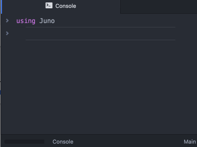
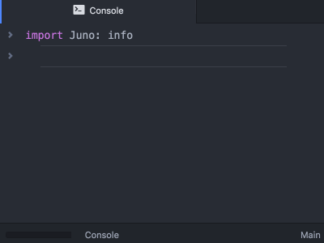

# Juno.jl

[](https://travis-ci.org/JunoLab/Juno.jl) [](https://JunoLab.github.io/JunoDocs.jl/latest)

This package defines [Juno](http://junolab.org/)'s frontend API (to install Juno, follow the instructions [here](https://github.com/JunoLab/uber-juno/blob/master/setup.md)). It is aimed primarily at allowing package authors to:

* Integrate with Juno's display system to define custom output for graphics and data structures
* Take advantage of frontend features (like showing progress metres or asking for user input) with appropriate fallbacks in other environments

All while having only a small, pure Julia dependency (this package) as opposed to the entire Atom.jl tree.

The code in the [`base` folder](src/base) shows what the package can do. Even fundamental types like arrays or `nothing` are rendered here; nothing is a special case, and anything they can do, you can do too.

## Frontend API

Show a progress meter for a computation:

```julia
@progress for ...
```


Allow the user to select from a list of options:

```julia
selector(xs) -> x
```



Get input in the console:

```julia
input()
```


Print `info` to the console in a nicer way:

```julia
info("foo")
```



See the docstrings of these functions for more detail.
